# 🏀 NBA Expected Field Goal (xFG) Model

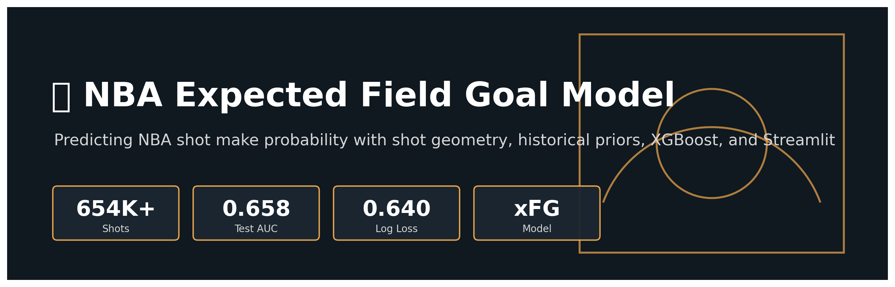

An end-to-end machine learning project that estimates the probability an NBA shot will be made using shot geometry, player history, team context, opponent context, and game state.

This project is best framed as an **expected field goal model**, or **xFG model**: given information available before a shot is taken, the model predicts the likelihood that the shot goes in.

---

## Live App

This repository includes an interactive Streamlit application:

```bash
streamlit run app/streamlit_app.py
```

The app allows users to select a player, shot action, shot location, quarter, clock, and home/away context, then returns the model's predicted make probability.

---

## Project Goal

The goal of this project is to answer:

> Given the information available before an NBA shot is attempted, what is the probability that the shot will be made?

This is different from simply predicting historical makes and misses. The goal is to build a probabilistic model of shot quality that can generalize to future shots.

In basketball terms, this is similar to building an **expected field goal percentage** model. A good model should understand that:

- a dunk is easier than a contested midrange jumper,
- Stephen Curry taking a three is different from an average player taking the same three,
- a shot late in the clock may differ from an early-clock attempt,
- teams and opponents provide additional context,
- historical shooting ability must be computed without using future information.

---

## What This Project Accomplishes

This project includes:

- A full NBA shot-level data pipeline
- Feature engineering for shot geometry, player history, team context, opponent defense, and game state
- Leakage-free historical player and team features using expanding-window priors
- Bayesian smoothing for low-sample historical statistics
- Logistic Regression baseline model
- XGBoost model
- Tuned XGBoost model using temporal validation
- Model evaluation with AUC, log loss, Brier score, calibration, ROC, PR curves, lift curves, and confusion matrices
- SHAP explainability
- Error analysis by zone, action type, and player
- A final frozen production model
- An interactive Streamlit app for shot probability prediction
- Automatically generated diagrams and project assets

---

## Application Preview

The Streamlit app turns the model into an interactive shot probability tool.

Users can configure:

- Player
- Shot action
- Shot location
- Quarter
- Time remaining
- Home/away context

The app returns:

- Predicted make probability
- Comparable league average
- Difference from league average
- Player profile
- Half-court shot visualization
- Readable explanation of the prediction context

---

## Machine Learning Architecture

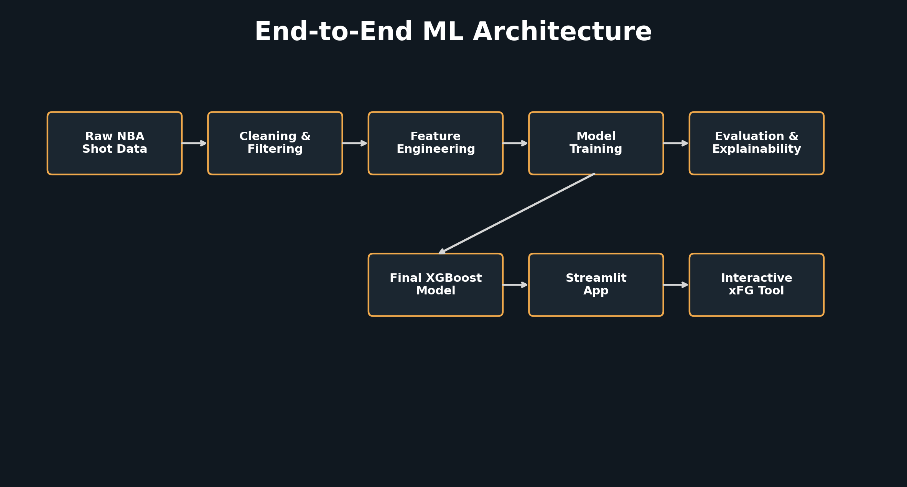

The project follows a full machine learning workflow:

```text
Raw NBA shot data
→ cleaning
→ feature engineering
→ historical priors
→ model training
→ evaluation
→ explainability
→ deployment
```

---

## Feature Engineering Pipeline

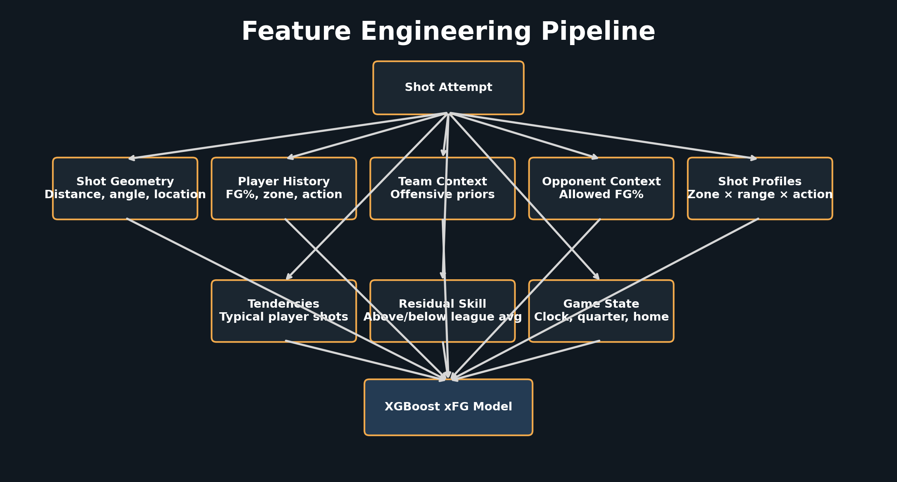

Feature engineering is the core of this project. The model uses several feature families that each answer a different basketball question.

| Feature Group | Purpose |
|---|---|
| Shot geometry | Describes physical shot difficulty |
| Action features | Encodes shot mechanics and type |
| Player history | Captures shooter skill |
| Team context | Captures offensive environment |
| Opponent context | Captures defensive environment |
| Shot profiles | Models interactions between location and action |
| Player tendencies | Captures whether a shot is typical for a player |
| Residual skill | Measures player skill relative to league expectation |
| Game state | Captures clock, quarter, home/away context |

---

## Dataset

The dataset consists of NBA shot-level data across multiple seasons.

Each row represents a single field goal attempt and includes information such as:

- Player
- Team
- Game date
- Shot location
- Shot distance
- Shot type
- Action type
- Quarter
- Clock
- Home and away teams
- Make/miss result

The final processed dataset contains approximately **654,000 shot attempts**.

---

## Temporal Train/Test Split

The project uses a temporal split instead of a random split.

| Split | Seasons |
|---|---|
| Training | 2022-23, 2023-24 |
| Testing | 2024-25 |

This matters because the model is intended to predict future shots. A random split would allow shots from the same season, and sometimes similar game contexts, to appear in both train and test data. The temporal split is a more realistic evaluation setup.

---

## Leakage Prevention

A major focus of this project is preventing target leakage.

For every historical feature, the current shot is excluded from its own calculation.

For example, when computing a player's prior zone FG%, the model only sees shots the player took **before** the current shot.

This is done using expanding-window cumulative statistics:

```text
prior makes = cumulative makes before current shot
prior shots = cumulative shots before current shot
prior FG%   = prior makes / prior shots
```

Bayesian smoothing is then applied so low-sample players or rare shot contexts are pulled toward league average.

This prevents unstable early-season or low-volume estimates from dominating the model.

---

## Key Feature Families

### 1. Shot Geometry

These features describe where the shot was taken:

- `SHOT_DISTANCE`
- `LOC_X`
- `LOC_Y`
- shot angle
- absolute shot angle
- corner three indicator
- zone
- zone range

These features answer:

> How physically difficult is the shot?

Shot distance consistently appears as one of the strongest predictors.

---

### 2. Action Features

Raw NBA action types are grouped into broader basketball categories:

- jump shot
- pull-up
- stepback
- fadeaway
- floater
- hook
- layup
- dunk
- turnaround
- running jump

This helps the model understand the mechanics of the attempt, not just the location.

A dunk at the rim and a floater in the paint may come from similar locations, but they are not equivalent shots.

---

### 3. Player Historical Priors

The model computes leakage-free historical shooting features for each player, including:

- overall prior FG%
- prior zone FG%
- prior action FG%
- prior 2PT%
- prior 3PT%
- prior shot counts

These features answer:

> How good has this player historically been before this shot?

---

### 4. Team Offensive Priors

Team-level features capture offensive context:

- team prior FG%
- team prior zone FG%
- team prior 2PT%
- team prior 3PT%

These features attempt to capture whether a player is operating within a stronger or weaker offensive environment.

---

### 5. Opponent Defensive Priors

Opponent features capture defensive context:

- opponent allowed FG%
- opponent allowed zone FG%
- opponent allowed 2PT%
- opponent allowed 3PT%

These features answer:

> How well has this opponent defended similar shots historically?

---

### 6. Shot Profile Interactions

The model creates combined shot profiles such as:

```text
Restricted Area | Less Than 8 ft. | dunk
In The Paint (Non-RA) | 8-16 ft. | floater
Mid-Range | 16-24 ft. | fadeaway
Above the Break 3 | 24+ ft. | pullup
```

This captures interactions between location and action type.

For example, a layup at the rim and a layup from 8-16 feet should not be treated the same.

---

### 7. Player Shot Tendencies

These features measure whether a shot is typical for a player:

- player tendency to shoot from a zone
- player tendency to use an action type
- player tendency to take a specific shot profile

These answer:

> Is this the kind of shot this player usually takes?

---

### 8. Player Residual Skill

Residual features compare a player's historical performance to league average for a given context.

For example:

```text
player zone residual = player prior zone FG% - league zone FG%
```

This captures whether a player is better or worse than expected from a specific type of shot.

---

## Model Development

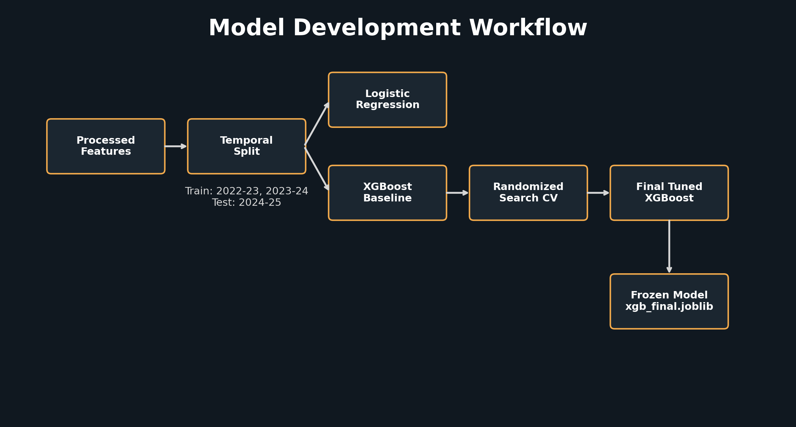

The project compares multiple models:

1. Logistic Regression baseline
2. XGBoost baseline
3. Tuned XGBoost

The final production model is the tuned XGBoost classifier.

---

## Model Results

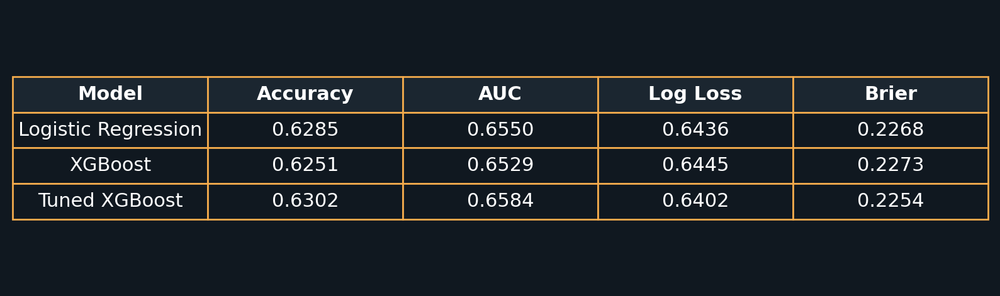

Final tuned XGBoost performance on the untouched 2024-25 test season:

| Metric | Value |
|---|---:|
| Accuracy | 0.6302 |
| AUC | 0.6584 |
| Log loss | 0.6402 |
| Brier score | 0.2254 |

The model is not intended to perfectly classify every make or miss. Shot outcomes are noisy. Instead, the goal is to produce meaningful probabilities that rank shot quality and calibrate reasonably against observed field goal percentage.

---

## Evaluation

The project uses several evaluation approaches.

### ROC Curve

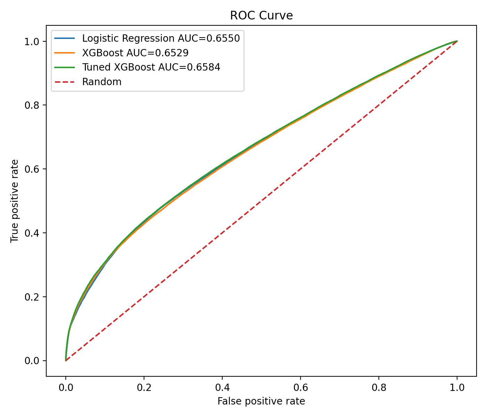

ROC AUC measures how well the model ranks made shots above missed shots.

---

### Precision-Recall Curve

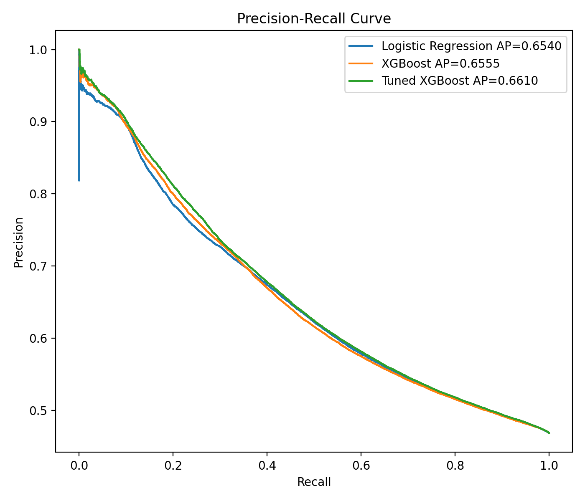

Precision-recall analysis is useful because make/miss prediction is inherently noisy and threshold-dependent.

---

### Calibration

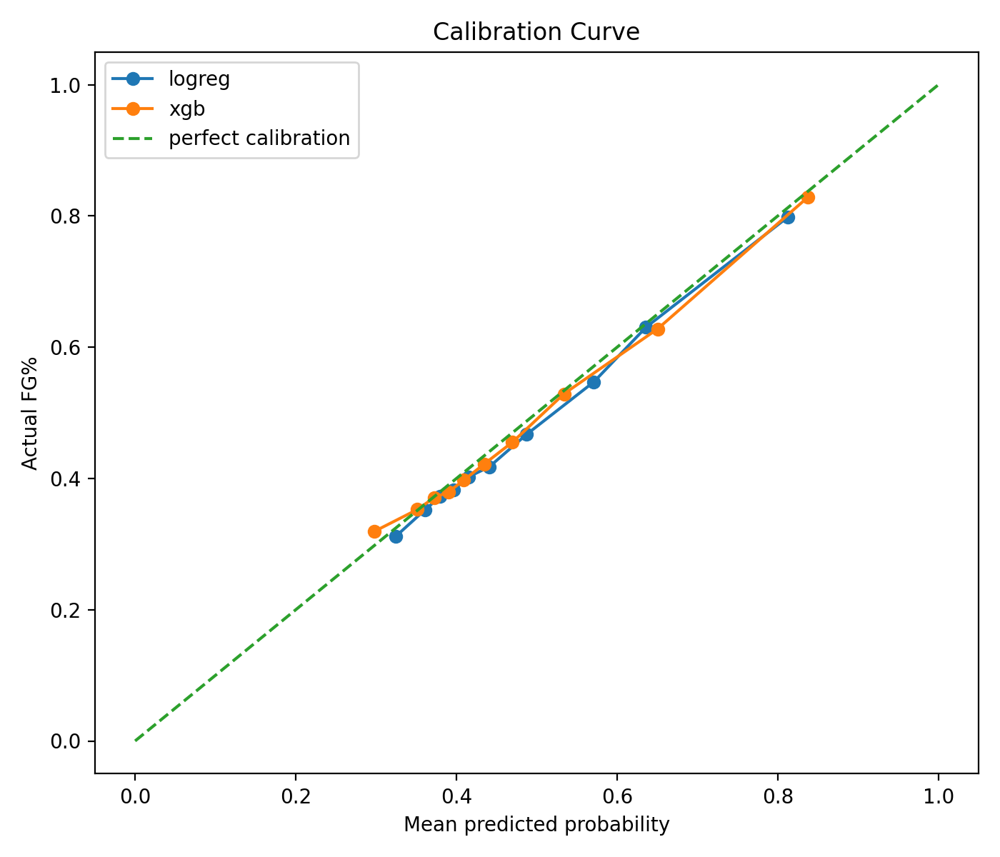

Calibration measures whether predicted probabilities match actual make rates.

For an xFG model, calibration matters because the output is a probability, not just a binary label.

A well-calibrated model should satisfy:

```text
Shots predicted at 60% should go in about 60% of the time.
```

---

### Probability Buckets

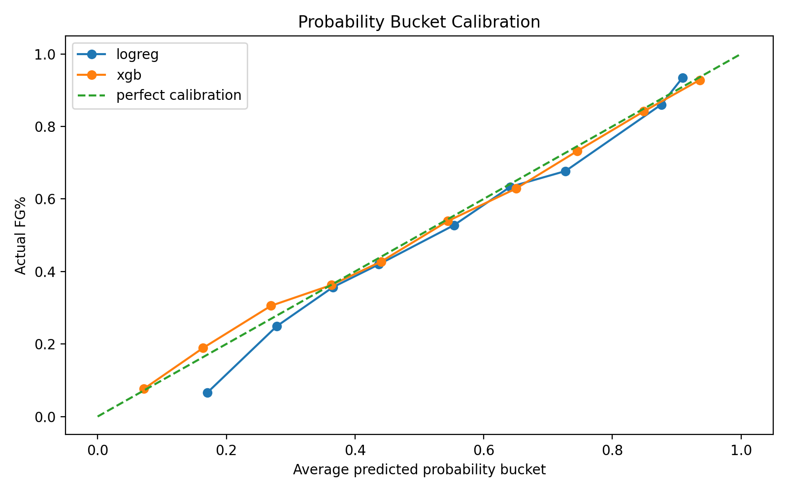

Bucketed calibration compares average predicted probability against actual field goal percentage for groups of shots.

---

### Lift Curve

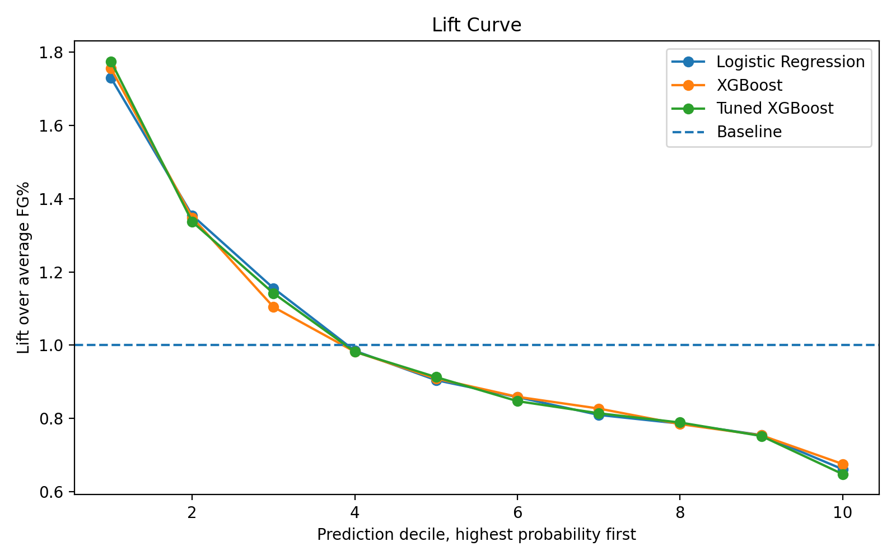

The lift curve shows whether the highest-probability shots actually convert at higher rates than average shots.

---

### Confusion Matrices

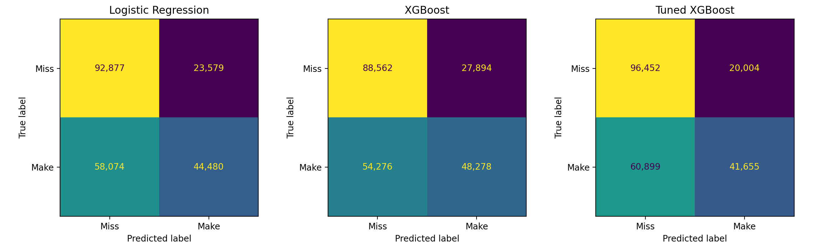

Confusion matrices show classification behavior at the default 0.5 threshold.

Since the project is fundamentally probabilistic, threshold metrics are secondary to AUC, log loss, Brier score, and calibration.

---

## Explainability

The project uses SHAP to interpret the XGBoost model.

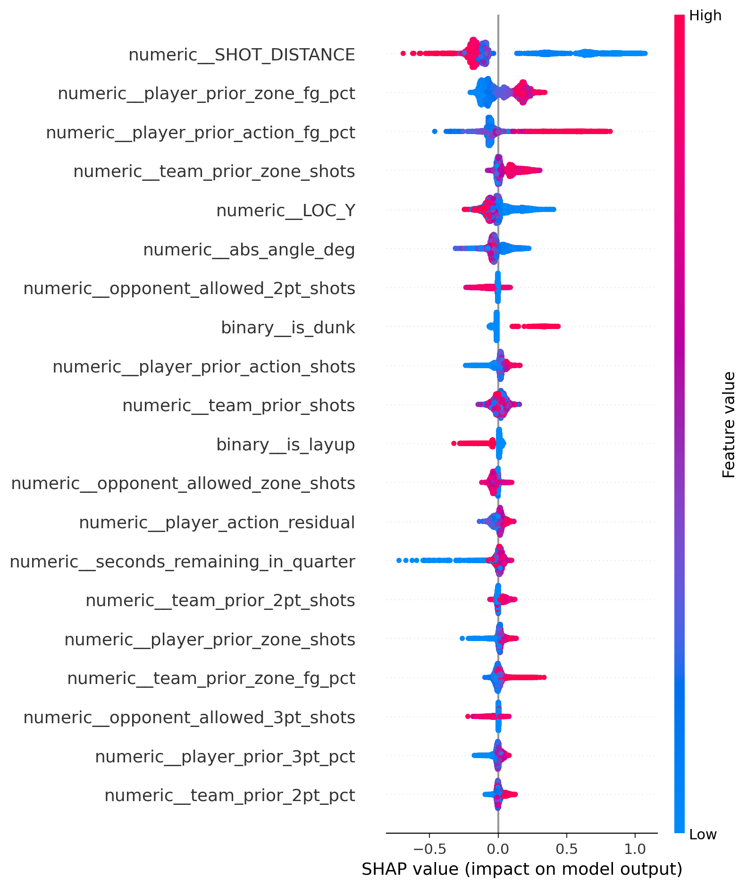

SHAP helps answer:

> Which features are driving the model's predictions?

Important feature families include:

- shot distance
- player prior zone FG%
- player prior action FG%
- shot profile interactions
- location features
- player historical skill
- team and opponent context

---

## Error Analysis

The project includes detailed error analysis reports:

```text
reports/error_by_zone.csv
reports/error_by_action.csv
reports/error_by_player.csv
reports/worst_false_positives.csv
reports/worst_false_negatives.csv
```

This analysis showed that the model struggles most with inherently difficult and noisy shot types such as:

- mid-range shots
- floaters
- hooks
- fadeaways
- turnarounds
- in-the-paint non-restricted-area shots

This finding makes basketball sense: these shots often depend on defender positioning, touch, balance, and contest level, none of which are fully captured in public shot-chart data.

---

## Streamlit Application

The final model is deployed locally through a Streamlit application.

Run:

```bash
streamlit run app/streamlit_app.py
```

The app includes:

- Player selector
- Shot action selector
- Shot location controls
- Quarter and clock controls
- Home/away selector
- Half-court visualization
- Predicted make probability
- League-average comparison
- Player profile summary
- Explanation section

The app makes the model interactive and easier to understand for non-technical users.

---

## Engineering Highlights

- Built a modular feature engineering pipeline under `src/features/`
- Computed leakage-free expanding-window historical priors
- Applied Bayesian smoothing to stabilize low-sample estimates
- Used temporal train/test splits to simulate future prediction
- Compared baseline and advanced models
- Tuned XGBoost with validation on a later season
- Evaluated both ranking and probability quality
- Added calibration analysis for probability reliability
- Added SHAP explainability for feature interpretation
- Built an interactive Streamlit application
- Generated project diagrams and assets programmatically

---

## Repository Structure

```text
nba-shot-prediction/
├── app/
│   ├── __init__.py
│   └── streamlit_app.py
├── data/
│   ├── raw/
│   └── processed/
├── docs/
│   ├── architecture.png
│   ├── banner.png
│   ├── feature_pipeline.png
│   ├── model_comparison.png
│   ├── model_comparison.md
│   ├── project_summary.json
│   └── training_pipeline.png
├── models/
│   ├── logreg.joblib
│   ├── xgb.joblib
│   ├── xgb_tuned.joblib
│   └── xgb_final.joblib
├── reports/
│   ├── figures/
│   ├── error_by_action.csv
│   ├── error_by_player.csv
│   ├── error_by_zone.csv
│   └── model diagnostics
├── scripts/
├── src/
│   ├── docs/
│   ├── features/
│   ├── models/
│   └── visualization/
├── requirements.txt
└── README.md
```

---

## How to Run

### 1. Clone the repository

```bash
git clone https://github.com/rohanc27/nba-shot-prediction.git
cd nba-shot-prediction
```

### 2. Create a virtual environment

```bash
python -m venv .venv
source .venv/bin/activate
```

### 3. Install dependencies

```bash
pip install -r requirements.txt
```

### 4. Build features

```bash
python -m src.features.build_features
```

### 5. Train models

```bash
python -m src.models.train_logreg
python -m src.models.train_xgb
python -m src.models.tune_xgb
```

### 6. Freeze final model

```bash
python -m src.models.freeze_final_model
```

### 7. Run diagnostics

```bash
python -m src.models.evaluate_models
python -m src.models.explain_xgb
python -m src.visualization.model_dashboard
python -m src.models.error_analysis
```

### 8. Run the app

```bash
streamlit run app/streamlit_app.py
```

---

## Main Scripts

| Script | Purpose |
|---|---|
| `src.features.build_features` | Build processed feature dataset |
| `src.models.train_logreg` | Train Logistic Regression baseline |
| `src.models.train_xgb` | Train XGBoost baseline |
| `src.models.tune_xgb` | Tune XGBoost hyperparameters |
| `src.models.freeze_final_model` | Freeze final production model |
| `src.models.evaluate_models` | Generate model metrics and calibration tables |
| `src.models.explain_xgb` | Generate SHAP explainability outputs |
| `src.visualization.model_dashboard` | Generate ROC, PR, lift, and confusion matrix plots |
| `src.models.error_analysis` | Generate error analysis CSV reports |
| `app.streamlit_app` | Interactive Streamlit application |

---

## Limitations

The model uses public shot-chart style data. It does not currently include:

- defender distance
- closest defender identity
- shot clock
- dribbles
- touch time
- pass context
- contest level
- play type
- score differential
- lineup context

These missing variables explain why some shot types remain difficult to predict. For example, two mid-range jumpers from the same location can have very different probabilities depending on whether the shooter is open, fading away, or heavily contested.

---

## Future Work

Potential improvements:

- Add NBA tracking data
- Include defender distance
- Include shot clock
- Include dribbles and touch time
- Add closest defender identity
- Add score differential and game context
- Add lineup context
- Add true per-shot SHAP explanations inside the Streamlit app
- Build a clickable court interface
- Generate player-specific xFG heatmaps
- Deploy the app publicly with Streamlit Cloud

---

## Lessons Learned

Several lessons came out of this project.

First, feature engineering mattered more than model choice. XGBoost improved over Logistic Regression, but the largest improvements came from better representations of player skill, shot profile, and historical context.

Second, leakage prevention is critical. Historical features are powerful, but only if they are computed using information available before the shot.

Third, probability quality matters. For an xFG model, calibration, log loss, and Brier score are as important as accuracy.

Fourth, public shot-chart data has a natural ceiling. Without defender tracking, shot clock, and contest information, some shot outcomes remain fundamentally noisy.

Finally, the most useful version of the project is not just a trained model. It is the full pipeline: data, features, training, evaluation, interpretation, and deployment.

---

## Summary

This project builds a complete NBA expected field goal modeling pipeline:

```text
Raw NBA shot data
→ feature engineering
→ leakage-free historical priors
→ model training
→ hyperparameter tuning
→ evaluation
→ explainability
→ error analysis
→ interactive deployment
```

The final result is a tuned XGBoost model and Streamlit app that estimate NBA shot make probability from player, location, action, and game context.
